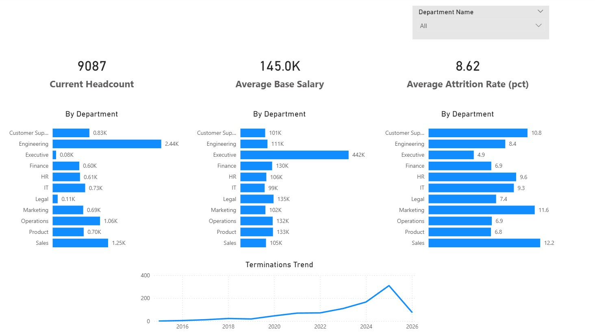
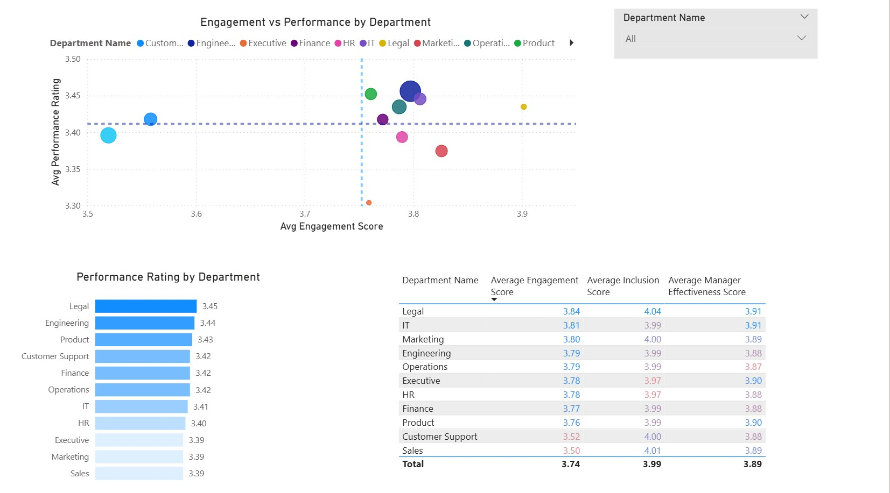

# Enterprise People Analytics Warehouse

## Overview
This project demonstrates an end-to-end people analytics solution built using PostgreSQL and Power BI. The goal was to transform raw HR data into a structured analytics warehouse and deliver executive-level insights on workforce trends.

## Objectives
- Centralize workforce data across multiple HR domains
- Build a relational analytics model using SQL
- Create KPI-driven views for business reporting
- Develop an executive dashboard for decision-making

## Tech Stack
- PostgreSQL (Data Warehouse)
- pgAdmin 4
- Power BI
- SQL (DDL, transformations, analytics views)

## Data Model
The warehouse follows a dimensional modeling approach:

### Dimensions
- dim_employee
- dim_department
- dim_job
- dim_location
- dim_date

### Fact Tables
- fact_compensation
- fact_performance
- fact_engagement
- fact_promotions
- fact_recruiting

### Semantic Layer (Views)
- vw_current_headcount
- vw_attrition_summary
- vw_attrition_rate_by_department
- vw_current_salary_by_department
- vw_performance_by_department
- vw_engagement_by_department
- vw_engagement_vs_performance

## Dashboard Preview

### Executive Overview

### Performance & Engagement Analysis

## Key Insights

### Workforce Overview

The organization consists of 9,087 employees, with an average base salary of $145K and an overall attrition rate of 8.62%, indicating a moderately stable workforce with some variability across departments.

### Engagement vs Performance

Engagement and performance show a modest positive relationship across departments. For example, Legal (Engagement: 3.84, Performance: 3.45) and Engineering (3.79, 3.44) demonstrate strong alignment, while Marketing (3.80, 3.39) and Sales (3.50, 3.39) underperform relative to their engagement levels.

### Top Performing Departments

Legal (3.45), Engineering (3.44), and Product (3.43) are the highest-performing departments, all maintaining performance above the organizational average (~3.40), suggesting strong execution and alignment.

### Underperforming Departments

Sales (Performance: 3.39, Engagement: 3.50) and Executive (3.30, 3.78) show lower performance relative to engagement, indicating potential inefficiencies in execution, leadership alignment, or role effectiveness.

### Attrition Risk Areas

Attrition is highest in Sales (12.2%), Marketing (11.6%), and Customer Support (10.8%), significantly above the company average of 8.62%, highlighting these as key risk areas for retention.

### Compensation Insights

Compensation varies significantly across departments, with Executive roles averaging $442K, far exceeding all other departments. However, this higher compensation does not correspond to the highest performance, suggesting a potential disconnect between pay and output.

### Workforce Distribution Insight

Large departments such as Engineering (2.44K employees) and Sales (1.25K employees) dominate headcount, meaning performance and attrition trends in these groups have a disproportionate impact on overall organizational outcomes.

### Stability vs Variability

Most departments cluster within a narrow performance range (3.39–3.45) and engagement range (3.50–3.84), indicating a generally stable workforce with limited performance differentiation across teams.

## Data Quality Checks

The project includes validation scripts to ensure:
- No duplicate primary keys
- Valid relationships between fact and dimension tables
- Logical business rules (e.g., termination date after hire date)
- Reasonable KPI outputs

## Architecture

Raw CSV → Staging Tables → Dimension & Fact Tables → SQL Views → Power BI Dashboard

## Future Improvements
- Add predictive attrition modeling
- Automate data ingestion pipeline
- Introduce role-based dashboards
- Expand workforce segmentation analysis
